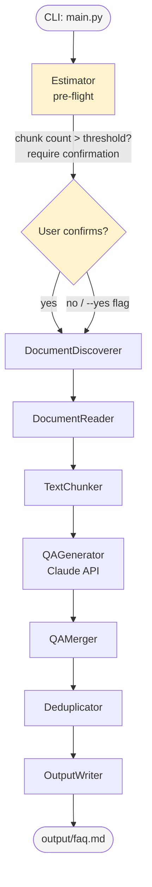

# Design Document: doc-faq-generator

## Overview

The doc-faq-generator is a Python CLI tool that automates FAQ creation from a folder of documents. Given a directory path, it discovers all PDF, DOCX, and TXT files, extracts their text, splits the text into overlapping chunks, sends each chunk to the Anthropic Claude API (`claude-sonnet-4-5`) with a structured generation prompt, merges all resulting Q&A pairs in document order, deduplicates them using exact-match normalization followed by TF-IDF cosine similarity, and writes the final FAQ to `output/faq.md` in Markdown format.

The tool is designed as a linear pipeline: each stage (discover → read → chunk → generate → merge → deduplicate → write) is deterministic and isolated, making it straightforward to test and extend. The API key is loaded exclusively from a `.env` file to avoid secret leakage.

### Key Design Goals

- **Correctness**: every document contributes at least one Q&A pair to the final output.
- **Resilience**: file-read errors and API failures are logged and skipped without aborting the whole run.
- **Reproducibility**: output ordering is deterministic (alphabetical path, then chunk index).
- **Security**: the API key is never passed on the command line or read from OS environment variables outside the `.env` loader.

---

## Architecture

The tool follows a classic **pipeline** architecture with five loosely coupled stages, each implemented as a module or class. A thin `main.py` orchestrator ties the stages together, handling argument parsing, `.env` loading, and the final summary print.



### Module Responsibilities

| Module | File | Responsibility |
|---|---|---|
| `main.py` | `main.py` | Entry point, argument parsing, `.env` loading, orchestration, progress + summary output |
| `discoverer` | `discoverer.py` | Recursive folder scan, extension filter, 10k-file cap |
| `reader` | `reader.py` | PDF / DOCX / TXT text extraction, per-file error handling |
| `chunker` | `chunker.py` | Sentence-boundary-aware 3 000-word chunks with 200-word overlap |
| `generator` | `generator.py` | Claude API calls, retry logic, JSON response parsing |
| `merger` | `merger.py` | Ordered collection of all QA pairs |
| `deduplicator` | `deduplicator.py` | Exact-match + TF-IDF cosine deduplication, per-document preservation |
| `writer` | `writer.py` | Markdown output formatting and file write |
| `estimator` | `estimator.py` | Pre-flight chunk count and API call estimate |

All modules live under a `faq_generator/` package directory. The entry point (`main.py`) is at the repository root.

---

## Components and Interfaces

### 1. CLI / Orchestrator (`main.py`)

**Responsibilities**: parse arguments, load the `.env`, call each pipeline stage in order, print per-document progress, print the final summary.

```python
def main() -> None:
    """Entry point. Exits with code 1 on validation errors, 2 on missing args."""
```

**Argument parsing** uses `argparse` with `folder_path` as a required positional argument and one optional flag:
- `--yes` / `-y`: skip the confirmation prompt when the estimated API call count exceeds the threshold (useful for scripted/CI use).
- `--confirm-threshold N` (default `50`): the chunk count above which confirmation is required.

**`.env` loading** uses `python-dotenv`'s `load_dotenv()` with `override=False`. After loading, the key is read from `os.environ`. If absent or empty the tool exits with the appropriate error message (see Requirement 3).

**Exit codes**:
- `0` — success
- `1` — runtime error (path not found, unreadable output, etc.)
- `2` — missing CLI argument
- `3` — user declined the pre-flight confirmation prompt

**Pre-flight flow** (runs after `.env` validation, before document discovery):
1. Call `estimate_chunks(paths)` on all discovered document paths.
2. Print the estimate to stdout:
   ```
   Estimated API calls: <N>  (<per-doc breakdown: file1.pdf → 3, file2.docx → 1, ...>)
   ```
3. If `total_chunks > confirm_threshold` AND `--yes` was not passed, print:
   ```
   This will make <N> API calls. Continue? [y/N]:
   ```
   Read from stdin. If the user types anything other than `y` or `yes` (case-insensitive), print `Aborted.` and exit with code `3`.
4. If `total_chunks <= confirm_threshold` OR `--yes` was passed, proceed silently.

---

### 2. Pre-Flight Estimator (`estimator.py`)

```python
from dataclasses import dataclass
from pathlib import Path

@dataclass
class EstimateResult:
    total_chunks: int          # total API calls that will be made
    per_doc: dict[Path, int]   # chunk count keyed by document path

def estimate_chunks(paths: list[Path], max_words: int = 3_000, overlap_words: int = 200) -> EstimateResult:
    """Read every document, count chunks, return estimate without making any API calls."""
```

**Algorithm**: For each path in `paths`, call `read_document(path)` and then `chunk_text(text, max_words, overlap_words)` to get the actual chunk list. Sum the lengths. If `read_document` returns `None` (file unreadable), contribute 0 chunks for that path. Return an `EstimateResult` with `total_chunks` and the per-document breakdown.

**Design rationale**: The estimator reuses the existing `reader` and `chunker` modules — it does not re-implement reading or splitting. This means the estimate is exact (not approximate): it is the true chunk count the pipeline will produce. The only cost is reading every document twice (once here, once in the main pipeline). For the document sizes this tool targets (≤ 100 MB each, ≤ 10 000 files) that is acceptable; a future optimisation could cache the extracted text in a temp structure and pass it to the pipeline.

---

### 3. Document Discoverer (`discoverer.py`)

```python
def discover_documents(folder: Path, max_depth: int = 10, max_files: int = 10_000) -> list[Path]:
    """Return paths to all .pdf/.docx/.txt files under `folder`, alphabetically sorted."""
```

Uses `os.walk` with a depth counter. Sorts the final list by `str(path)` for deterministic ordering. If the count exceeds `max_files`, logs a `WARNING` and truncates to the first `max_files` paths.

---

### 4. Document Reader (`reader.py`)

```python
def read_document(path: Path) -> str | None:
    """Extract text from a PDF, DOCX, or TXT file.
    Returns None and logs a warning on error."""
```

Dispatch table by extension:

| Extension | Library | Method |
|---|---|---|
| `.txt` | built-in | `open(path, encoding='utf-8')` |
| `.pdf` | `pdfplumber` | iterate pages, `page.extract_text()` |
| `.docx` | `python-docx` | iterate `doc.paragraphs`, join `para.text` |

File size is checked with `path.stat().st_size` before reading; files > 100 MB are skipped with a warning. Encoding errors on `.txt` files are caught and logged separately (Requirement 2.5).

---

### 5. Text Chunker (`chunker.py`)

```python
def chunk_text(text: str, max_words: int = 3_000, overlap_words: int = 200) -> list[str]:
    """Split text into overlapping, sentence-boundary-aware chunks."""
```

**Algorithm**:

1. Tokenize into words by splitting on whitespace.
2. If `len(words) <= max_words`, return `[text]` (single chunk, no overlap).
3. Otherwise, accumulate words up to `max_words`. Scan the last 100 words for a sentence-ending boundary (word ending in `.`, `!`, or `?`). If found, split there; otherwise split at exactly `max_words`.
4. The next chunk begins `overlap_words` words before the split point.
5. Repeat until no words remain.

**Design rationale**: sentence-boundary splitting avoids breaking mid-sentence context for the model. The 200-word overlap preserves the tail of the previous chunk so cross-boundary Q&A topics are not lost.

---

### 6. QA Generator (`generator.py`)

```python
def generate_qa_pairs(chunk: str, chunk_id: str, api_key: str) -> list[QAPair]:
    """Send a chunk to Claude and return parsed QA pairs.
    Retries on HTTP 429; logs and returns [] on unrecoverable error."""
```

**Prompt design**: The system prompt instructs the model to act as a technical writer. The user message embeds the chunk text and asks for 3–10 Q&A pairs as a JSON array:

```
You are a technical documentation assistant. Read the following text and generate between 3 and 10 FAQ entries.
Return ONLY a JSON array with objects having "question" and "answer" keys. No prose, no markdown fences.

Text:
{chunk}
```

**Response parsing**: The raw response text is parsed with `json.loads()`. Any element missing `question` or `answer`, or where either field is empty/whitespace, is discarded.

**Retry logic**:
- On HTTP 429: sleep 10 s, retry up to 3 times.
- After 3 failures: log error with `chunk_id`, return `[]`.
- Any other `anthropic.APIError` or `json.JSONDecodeError`: log error with `chunk_id`, return `[]`.

**Library**: `anthropic` Python SDK (`anthropic.Anthropic(api_key=...)`).

---

### 7. QA Merger (`merger.py`)

```python
def merge_qa_pairs(doc_chunks: list[DocChunkResult]) -> list[QAPair]:
    """Flatten all QA pairs ordered by doc path (alphabetical) then chunk index."""
```

`DocChunkResult` carries `doc_path: Path`, `chunk_index: int`, and `pairs: list[QAPair]`. The merger sorts by `(str(doc_path), chunk_index)` and concatenates the `pairs` lists in order.

---

### 8. Deduplicator (`deduplicator.py`)

```python
def deduplicate(pairs: list[QAPair], similarity_threshold: float = 0.85) -> tuple[list[QAPair], int]:
    """Return (deduplicated_pairs, removed_count)."""
```

**Three-pass algorithm**:

1. **Exact-match pass**: Normalize each question (lowercase, collapse whitespace). Build a `seen: set[str]` and keep only the first occurrence.
2. **TF-IDF cluster pass** (two sub-steps):
   - Fit a `TfidfVectorizer` on all remaining normalized questions and compute the full pairwise cosine similarity matrix.
   - Build clusters: use union-find (or equivalent) to group all pairs where pairwise similarity ≥ `threshold`. This collects the *entire* cluster before any selection is made.
   - From each cluster, retain the single `QAPair` with the greatest `len(question) + len(answer)`. Ties are broken by earliest position in the merged input order.
3. **Per-document preservation**: After both passes, check if any source document has no surviving pairs. If so, restore the pair from that document with the greatest `len(question) + len(answer)` from the original input. Ties are broken by earliest position in the merged input order.

**Library**: `scikit-learn`'s `TfidfVectorizer` and `cosine_similarity`.

---

### 9. Output Writer (`writer.py`)

```python
def write_faq(pairs: list[QAPair], output_path: Path) -> None:
    """Write the FAQ Markdown file. Raises OSError on write failure."""
```

**Markdown structure**:
```
# FAQ

### <document basename>

## <question>

<answer>

### <next document basename>
...
```

Groups are created by iterating pairs and inserting a `###` heading whenever `pair.doc_path` changes. The `output/` directory is created with `output_path.parent.mkdir(parents=True, exist_ok=True)` before writing.

---

## Data Models

All data models are implemented as Python `dataclass` objects for clarity and immutability.

```python
from dataclasses import dataclass
from pathlib import Path

@dataclass
class QAPair:
    question: str          # non-empty question string
    answer: str            # non-empty answer string
    doc_path: Path         # originating document path (absolute)
    chunk_index: int       # 0-based chunk index within the document

@dataclass
class DocChunkResult:
    doc_path: Path         # originating document path
    chunk_index: int       # 0-based position within the document
    pairs: list[QAPair]    # QA pairs generated from this chunk (may be empty)

@dataclass
class ProcessingStats:
    documents_processed: int = 0
    qa_pairs_generated: int  = 0
    duplicates_removed: int  = 0
```

### Data Flow


---

## Correctness Properties

*A property is a characteristic or behavior that should hold true across all valid executions of a system — essentially, a formal statement about what the system should do. Properties serve as the bridge between human-readable specifications and machine-verifiable correctness guarantees.*

### Property 1: Chunk size is bounded

*For any* non-empty document text, every chunk produced by `chunk_text` SHALL contain at most 3,000 words (whitespace-delimited tokens).

**Validates: Requirements 4.1, 4.2**

---

### Property 2: Chunking is lossless

*For any* non-empty document text, the concatenation of all chunk texts (after stripping the 200-word overlap prefix from every chunk beyond the first) SHALL contain every word from the original text in the same order, with no words added or dropped.

**Validates: Requirements 4.1, 4.2, 4.3, 4.4**

---

### Property 3: Chunk structural invariants

*For any* document text, `chunk_text` SHALL satisfy both of the following simultaneously:
- If the word count is ≤ 3,000, the result is a single-element list containing the unmodified original text.
- If the word count is > 3,000, the first 200 words of chunk `i` (i > 0) are identical to the last 200 words of chunk `i − 1`.

**Validates: Requirements 4.3, 4.4**

---

### Property 4: QA pair fields are non-empty after parsing

*For any* JSON array returned by the Claude API (including arrays that mix valid and malformed entries), every `QAPair` in the output of `generate_qa_pairs` SHALL have a non-empty, non-whitespace `question` and a non-empty, non-whitespace `answer`; no malformed entry shall appear in the output.

**Validates: Requirements 5.2, 5.3**

---

### Property 5: Merger preserves all pairs in deterministic order

*For any* collection of `DocChunkResult` objects (in any input order), `merge_qa_pairs` SHALL return a list that (a) contains every `QAPair` from every chunk unchanged and (b) is ordered by `str(doc_path)` alphabetically, then by ascending `chunk_index` within each document — producing the same output for any permutation of the input.

**Validates: Requirements 6.1, 6.2, 6.3**

---

### Property 6: Deduplication produces unique questions

*For any* list of `QAPair` objects, the output of `deduplicate` SHALL contain no two pairs whose questions are identical after normalization (lowercase + collapsed whitespace), and no two pairs whose TF-IDF cosine similarity exceeds 0.85.

**Validates: Requirements 7.1, 7.2**

---

### Property 7: Deduplication is idempotent

*For any* list of `QAPair` objects, applying `deduplicate` twice SHALL produce the same result as applying it once: the second application removes zero additional pairs.

**Validates: Requirements 7.1, 7.2**

---

### Property 8: Per-document QA pair preservation

*For any* list of `QAPair` objects that contains at least one pair per distinct `doc_path`, the output of `deduplicate` SHALL contain at least one `QAPair` for every distinct `doc_path` that appeared in the input.

**Validates: Requirements 7.4**

---

### Property 9: Output Markdown contains every surviving QA pair

*For any* deduplicated list of `QAPair` objects, the Markdown string produced by `write_faq` SHALL contain every `question` and every `answer` from the list, and each document's `basename` SHALL appear as a `###` heading preceding that document's pairs.

**Validates: Requirements 8.3, 8.4, 8.5**

---

## Error Handling

### Error Categories and Responses

| Category | Condition | Response |
|---|---|---|
| Missing CLI arg | No folder path given | Print usage; exit 2 |
| Bad folder path | Path not found | `Error: path '<p>' not found`; exit 1 |
| Not a directory | Path is a file | `Error: '<p>' is not a directory`; exit 1 |
| No documents found | Folder has no `.pdf`/`.docx`/`.txt` | `No supported documents found in '<p>'`; exit 1 |
| Missing `.env` | `.env` not in CWD | `Error: .env file not found in working directory`; exit non-zero |
| Missing API key | Key absent in `.env` | `Error: ANTHROPIC_API_KEY not found in .env file`; exit non-zero |
| Empty API key | Key present but `""` | `Error: ANTHROPIC_API_KEY is empty`; exit non-zero |
| File too large | > 100 MB | Log warning, skip file, continue |
| UTF-8 decode error | `.txt` not UTF-8 | Log warning with path + reason, skip, continue |
| File read error | FS / parse failure | Log warning with path + reason, skip, continue |
| Empty document text | 0 words extracted | Log warning, produce 0 chunks, continue |
| API rate limit | HTTP 429 | Wait 10 s, retry ≤ 3 times; log error + skip chunk on exhaustion |
| API other error | Non-429 API error | Log error with chunk ID, skip chunk, continue |
| JSON parse error | Malformed model response | Log error with chunk ID, return `[]`, continue |
| User aborts pre-flight | User answers "n" to confirmation prompt | Print `Aborted.`; exit 3 |
| Output write error | FS error on `output/faq.md` | Print error with path + reason; exit non-zero |

### Logging Strategy

The tool uses Python's standard `logging` module configured at `INFO` level by default, writing to `stderr`. `WARNING` messages are used for skippable conditions (bad files, empty docs); `ERROR` for failures that cause data loss (chunk skipped due to API failure).

Progress messages (per-document, per-chunk, final summary) are printed to `stdout` using `print()` to keep them separate from the log stream and easy to capture or suppress.

---

## Testing Strategy

### Unit Tests

Unit tests are written with `pytest`. Each module is tested in isolation using mocks for external I/O (filesystem, Claude API).

**Key unit test areas**:
- `chunker.py`: sentence-boundary split, overlap prepend, single-chunk path, zero-word text.
- `reader.py`: dispatch by extension, size guard, UTF-8 error path, parse error path.
- `deduplicator.py`: exact-match normalization, TF-IDF full-cluster formation (union-find), longest-pair selection per cluster, per-document preservation, removed count.
- `generator.py`: successful parse, discard of malformed entries, retry on 429, error handling on other failures.
- `writer.py`: heading structure, group-by-document, directory creation.
- `discoverer.py`: depth limit, extension filter, 10k cap.

### Property-Based Tests

Property-based tests are written with **Hypothesis** (the standard PBT library for Python).

Each test is configured with `settings(max_examples=100)` and annotated with a comment referencing the design property:

```python
# Feature: doc-faq-generator, Property N: <property_text>
```

**Property tests**:

- **Property 1** — Chunk size bounded: generate random text strings of varying lengths, assert every chunk has word count ≤ 3,000.
- **Property 2** — Chunking is lossless: generate random text strings, reconstruct original words from chunks (stripping overlap), assert all original words present in order.
- **Property 3** — Chunk structural invariants: generate short text (≤ 3,000 words) and long text (> 3,000 words), assert single-chunk for short and overlap correctness for long.
- **Property 4** — QA pair fields non-empty: generate plausible JSON arrays (including malformed entries), assert every returned `QAPair` has non-empty `question` and `answer`.
- **Property 5** — Merger preserves all pairs in deterministic order: generate shuffled `DocChunkResult` lists, assert output contains all pairs ordered by `(doc_path, chunk_index)` regardless of input order.
- **Property 6** — Deduplication unique questions: generate lists of `QAPair` objects (including exact and near-duplicate questions), assert no two output questions share normalized text or exceed 0.85 similarity.
- **Property 7** — Deduplication idempotence: generate lists of `QAPair` objects, assert applying `deduplicate` twice produces same result as once.
- **Property 8** — Per-document preservation: generate lists of `QAPair` objects with ≥ 1 pair per `doc_path`, assert every `doc_path` has ≥ 1 pair in output.
- **Property 9** — Output completeness: generate lists of `QAPair` objects, assert every `question` and `answer` appears in the generated Markdown, and every `basename` appears as a `###` heading.

### Integration Tests

Integration tests run against the full pipeline with a small fixture folder (3–5 real documents) and a mocked Claude API response (using `unittest.mock.patch`). They verify:

1. The end-to-end pipeline produces an `output/faq.md` that contains `# FAQ`.
2. Every fixture document's basename appears as a `###` heading.
3. The summary printed to stdout matches the actual counts.
4. A folder with no supported documents exits with code 1.
5. A missing `.env` exits with a non-zero code.

### Test Coverage Target

≥ 90% line coverage across all non-entry-point modules, enforced with `pytest-cov`.
