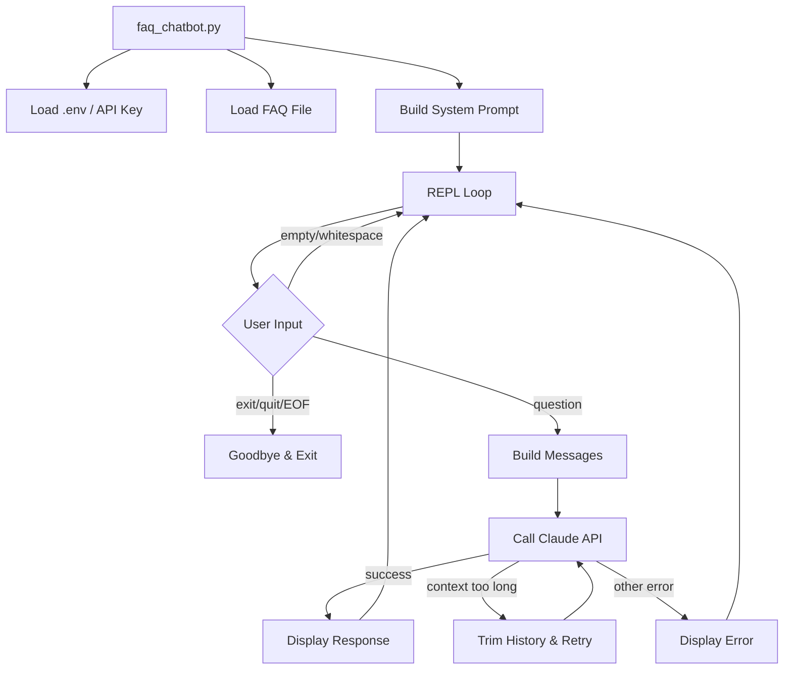

# Design Document: FAQ Chatbot

## Overview

The FAQ Chatbot is a Python CLI application that provides an interactive terminal interface for users to ask questions about the generated FAQ document. It loads `output/faq.md`, embeds it in a system prompt with caching enabled, and uses the Anthropic Claude API to answer user questions in a multi-turn conversation.

The design prioritizes simplicity: a single-file entry point (`faq_chatbot.py`) at the repo root that reuses existing project patterns for `.env` loading and Anthropic SDK usage. The chatbot maintains conversation history within a session and trims it when context limits are hit.

## Architecture



**Architecture Decisions:**

1. **Single-file design** — The chatbot is simple enough (startup validation, REPL loop, API call) that a single `faq_chatbot.py` module keeps things straightforward. No internal package needed.

2. **Separate entry point from FAQ generator** — The chatbot is run independently (`python faq_chatbot.py`), not as a subcommand of the generator. This keeps the two tools decoupled.

3. **Reuse existing patterns** — Uses `python-dotenv` for `.env` loading and `anthropic` SDK client, matching the patterns already established in `faq_generator/generator.py`.

4. **Stateful client instance** — A single `anthropic.Anthropic` client is created at startup and reused for all turns, enabling prompt cache hits.

## Components and Interfaces

### `faq_chatbot.py` — Main Module

```python
# Public interface (functions called from main)

def load_faq(path: str = "output/faq.md") -> str:
    """Load and validate FAQ file content.
    
    Returns the full text content.
    Exits with non-zero code if:
      - File doesn't exist
      - File is empty/whitespace-only
      - File can't be read (permission/encoding error)
      - File exceeds 100,000 characters
    """

def load_api_key() -> str:
    """Load ANTHROPIC_API_KEY from .env in working directory.
    
    Returns the API key string.
    Exits with non-zero code if:
      - .env file doesn't exist
      - Key is missing or whitespace-only
    """

def build_system_prompt(faq_content: str) -> list[dict]:
    """Construct the system message blocks with cache_control.
    
    Returns a list of content blocks suitable for the `system` parameter
    of the Anthropic messages API, with cache_control on the FAQ block.
    """

def is_exit_command(user_input: str) -> bool:
    """Check if input is an exit command (exit/quit, case-insensitive, trimmed)."""

def trim_history(history: list[dict], keep_latest: int = 2) -> list[dict]:
    """Remove oldest message pairs from history, keeping `keep_latest` pairs.
    
    A pair is one user message + one assistant message.
    Returns the trimmed history.
    """

def send_message(
    client: anthropic.Anthropic,
    system: list[dict],
    history: list[dict],
    user_message: str,
    max_tokens: int = 1024,
    timeout: float = 30.0,
) -> str:
    """Send a message to Claude and return the response text.
    
    Raises:
      ContextTooLongError: if the API rejects due to context length
      APIError: on other API failures
      TimeoutError: if request exceeds timeout
    """

def main() -> None:
    """Entry point: validate inputs, run REPL loop."""
```

### Custom Exceptions

```python
class ContextTooLongError(Exception):
    """Raised when the API rejects a request due to context length."""
    pass
```

### System Prompt Structure

The system prompt uses a two-block structure:

```python
system = [
    {
        "type": "text",
        "text": (
            "You are a helpful FAQ assistant. Answer questions using ONLY the "
            "information in the FAQ document below. If the FAQ does not contain "
            "enough information to answer a question, say so explicitly. Do not "
            "use any knowledge outside the FAQ document.\n\n"
            "---BEGIN FAQ DOCUMENT---\n"
            f"{faq_content}\n"
            "---END FAQ DOCUMENT---"
        ),
        "cache_control": {"type": "ephemeral"},
    }
]
```

**Design Decision:** A single system block (instructions + FAQ) rather than two separate blocks. This keeps the cache boundary simple — one `cache_control` marker on the one block caches the entire system prompt. The delimiter markers (`---BEGIN FAQ DOCUMENT---` / `---END FAQ DOCUMENT---`) clearly separate instructions from content within the single block.

## Data Models

### Conversation History

The conversation history is a plain Python list of message dictionaries matching the Anthropic messages API format:

```python
history: list[dict] = [
    {"role": "user", "content": "What encryption does Acme use?"},
    {"role": "assistant", "content": "Acme Cloud Storage uses AES-256..."},
    {"role": "user", "content": "And what about in transit?"},
    {"role": "assistant", "content": "For data in transit, TLS 1.3 is used."},
]
```

**Invariant:** The history always contains an even number of entries, alternating `user` → `assistant`. A user message is appended before the API call; the assistant response is appended after a successful response.

### Message Assembly for API Call

Each API call assembles the request as:

```python
client.messages.create(
    model="claude-sonnet-4-5",
    max_tokens=1024,
    system=system_prompt_blocks,   # Cached via cache_control
    messages=history + [{"role": "user", "content": user_input}],
    timeout=30.0,
)
```

### History Trimming Strategy

When the API returns a context-length error:
1. Remove the oldest user-assistant pair (2 entries from the front)
2. Retry the request
3. Repeat until only the current user message remains
4. If it still fails with just the current message, display an error and allow the user to continue

## Correctness Properties

*A property is a characteristic or behavior that should hold true across all valid executions of a system — essentially, a formal statement about what the system should do. Properties serve as the bridge between human-readable specifications and machine-verifiable correctness guarantees.*

**Property Reflection:**

After analyzing the acceptance criteria, I identified the following consolidations:
- Requirements 1.3 and 2.3 (whitespace rejection) can be tested by a single property about whitespace-only string rejection, parameterized by context (FAQ content vs API key).
- Requirements 3.1 and 3.2 (FAQ verbatim inclusion and delimiters) can be combined into one property about system prompt construction preserving FAQ content within delimiters.
- Requirements 7.3 and 7.4 (exit command matching and non-matching) are complementary and can be tested as a single property about exit command classification.
- Requirements 4.1 and 9.3 (history structure invariant and prompt immutability) are distinct invariants tested separately.
- Requirements 4.2 and 9.1 (request assembly and cache_control inclusion) can be combined into one property about correct request construction.

### Property 1: FAQ Content Preservation in System Prompt

*For any* valid FAQ content string (non-empty, non-whitespace, under 100,000 characters), the constructed system prompt SHALL contain the exact, unmodified FAQ content enclosed within clearly identifiable delimiter markers.

**Validates: Requirements 3.1, 3.2**

### Property 2: Whitespace-Only Input Rejection

*For any* string composed entirely of whitespace characters (spaces, tabs, newlines, or their combinations), the FAQ file validation SHALL reject the content and the API key validation SHALL reject the key.

**Validates: Requirements 1.3, 2.3**

### Property 3: Exit Command Classification

*For any* string, if stripping leading/trailing whitespace and converting to lowercase produces exactly "exit" or "quit", it SHALL be classified as an exit command; otherwise it SHALL be classified as a question.

**Validates: Requirements 7.3, 7.4**

### Property 4: Conversation History Alternation Invariant

*For any* sequence of successful interactions (user messages followed by assistant responses), the conversation history SHALL always contain an even number of entries with strictly alternating roles: user at even indices, assistant at odd indices.

**Validates: Requirements 4.1**

### Property 5: History Trimming Preserves Recency

*For any* conversation history of N pairs (where N >= 2), trimming SHALL remove pairs from the front (oldest) and the resulting history SHALL be a contiguous suffix of the original history, preserving the most recent exchanges.

**Validates: Requirements 4.4**

### Property 6: Request Assembly Completeness

*For any* system prompt, conversation history, and new user message, the assembled API request SHALL include the system prompt with `cache_control: {"type": "ephemeral"}`, the full conversation history, and the new user message as the final entry.

**Validates: Requirements 4.2, 9.1**

### Property 7: Empty Input Does Not Trigger API Call

*For any* string composed entirely of whitespace characters (including the empty string), submitting it as user input SHALL NOT result in an API call and SHALL re-display the prompt.

**Validates: Requirements 6.4**

### Property 8: System Prompt Immutability Across Turns

*For any* sequence of conversation turns within a session, the system prompt blocks passed to the API SHALL be byte-identical on every turn.

**Validates: Requirements 9.3**

## Error Handling

| Scenario | Behavior |
|----------|----------|
| FAQ file not found | Print error, exit code 1 |
| FAQ file empty/whitespace | Print error, exit code 1 |
| FAQ file unreadable (permission/encoding) | Print error, exit code 1 |
| FAQ file > 100,000 chars | Print error, exit code 1 |
| `.env` file not found | Print error, exit code 1 |
| API key missing/whitespace | Print error, exit code 1 |
| API error (non-context-length) | Print warning, continue session |
| API timeout (>30s) | Print timeout message, continue session |
| Context length exceeded | Trim history, retry; if still fails, print error, continue session |
| EOF (Ctrl+D) | Print goodbye, exit code 0 |
| KeyboardInterrupt (Ctrl+C) | Print goodbye, exit code 0 |

**Error Detection for Context Length:**

The Anthropic SDK raises `anthropic.BadRequestError` when the input exceeds context limits. The error message typically contains "context" or "token" keywords. The `send_message` function catches this specific case and raises `ContextTooLongError` so the REPL loop can trigger the trimming logic.

## Testing Strategy

**Testing Framework:** pytest (already configured) + hypothesis (already in dev dependencies)

**Dual Testing Approach:**

### Unit Tests (example-based)
- File loading: missing file, empty file, permission error, encoding error, oversized file
- API key loading: missing .env, missing key, empty key
- System prompt: contains FAQ-only instruction, contains "cannot answer" instruction
- REPL behavior: welcome message display, prompt indicator, response formatting
- Exit commands: "exit", "quit", Ctrl+D
- Error display: API errors, timeouts
- Timeout configuration: verify 30s timeout is set
- Model configuration: verify `claude-sonnet-4-5` is used

### Property Tests (hypothesis)
- **Property 1:** Generate random non-whitespace strings; verify they appear verbatim in the system prompt within delimiters
- **Property 2:** Generate whitespace-only strings; verify rejection by both FAQ loader and API key validator
- **Property 3:** Generate strings with random casing/whitespace padding of "exit"/"quit" plus non-matching strings; verify correct classification
- **Property 4:** Simulate sequences of user/assistant pairs; verify alternation invariant holds
- **Property 5:** Generate histories of varying lengths; trim and verify result is a suffix
- **Property 6:** Generate random system prompts, histories, and messages; verify assembled request structure
- **Property 7:** Generate whitespace-only strings; verify no API call is made (using a mock client)
- **Property 8:** Simulate multiple turns; verify system prompt blocks are identical across calls

**Property Test Configuration:**
- Minimum 100 iterations per property test (hypothesis default is 100)
- Each test tagged with: `# Feature: faq-chatbot, Property {N}: {description}`

**Integration Tests:**
- End-to-end: startup with valid FAQ, ask a question, verify response displayed
- Multi-turn: ask follow-up, verify history sent
- These use mocked Anthropic client to avoid real API calls in CI
